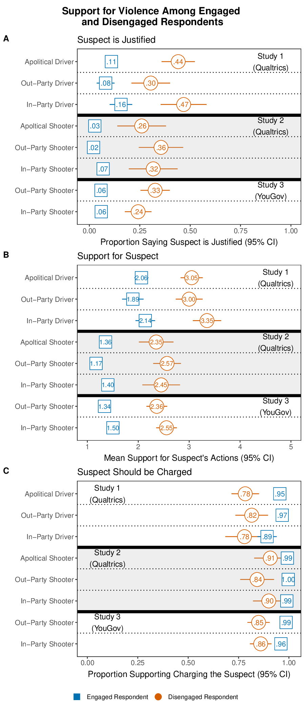
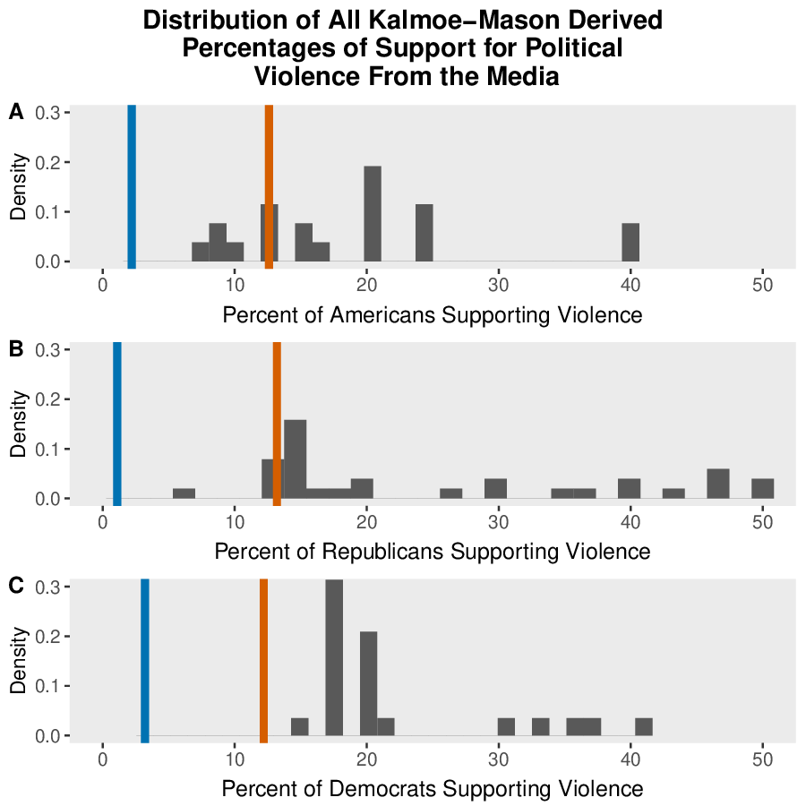
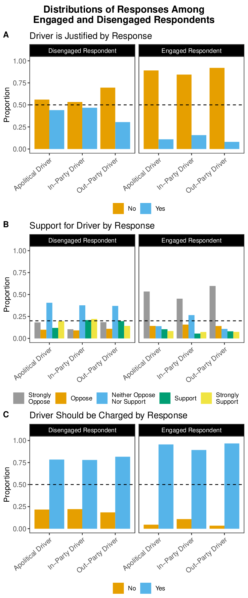
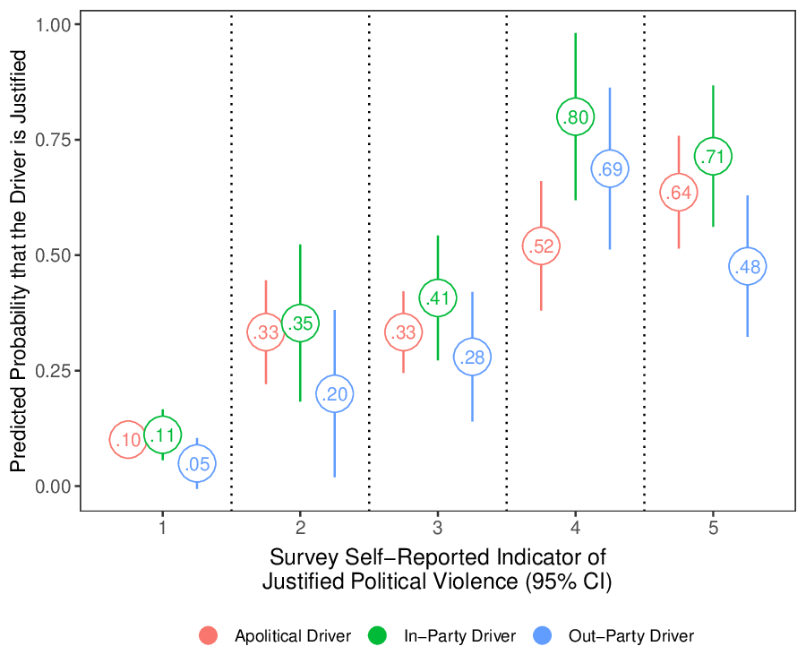
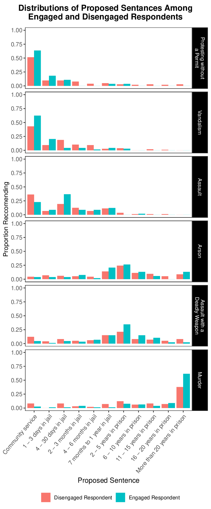
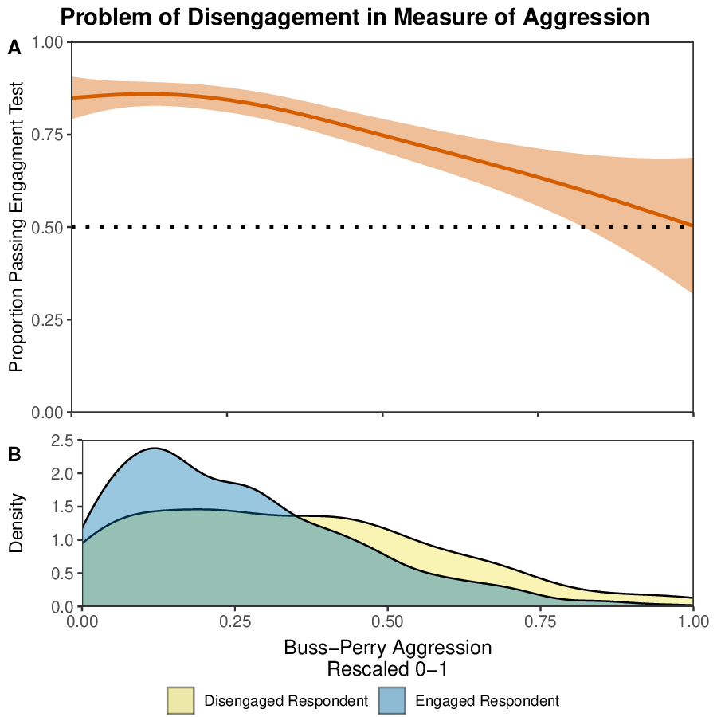

# Reproducing "Current Research Overstates American Support for Political Violence"

**Westwood et al. (2022) PNAS**

DOI: 10.1073/pnas.2116870119

---

# Part 1: The Paper

## Core Claim

Prior survey research reports ~20% of Americans support political violence.

**Westwood et al. argue this is inflated by 3-8x** due to:
1. Survey satisficing (disengaged respondents)
2. Measurement error in abstract questions
3. Correlation inflation in correlates analysis

---

# The Problem: Survey Satisficing

**Satisficing** = respondents who don't engage with survey content

- Click through without reading
- Random or careless responses
- Fail comprehension checks

These respondents systematically inflate violence support estimates.

---

# Study Design Overview

| Study | Platform | Date | n | Design |
|-------|----------|------|---|--------|
| Study 1 | Qualtrics | Jan 2021 | 1,002 | Car-ramming vignette |
| Study 2 | Qualtrics | Apr 2021 | 1,023 | Shooting vignette |
| Study 3 | YouGov | Nov 2021 | 1,863 | Shooting (weighted) |
| Study 4 | Qualtrics | Jan 2021 | 1,009 | Sentencing task |

Total cost: ~$25,000 in survey fees

---

# The Engagement Screen

Respondents classified as **Engaged** or **Disengaged** based on comprehension:

```r
# preprocess1.R:127-129
study1$passed <- "Disengaged Respondent"
study1$passed[study1$Q43 == "Florida" &
              study1$partisantreatment==1] <- "Engaged Respondent"
study1$passed[study1$Q49 == "Oregon" &
              study1$partisantreatment==2] <- "Engaged Respondent"
```

Simple factual question: "In what state did the incident occur?"

---

# Key Finding: Engagement Matters



**Study 1** (Political treatments):
- Engaged: 12.1%
- Disengaged: 37.9%
- Ratio: **3.1x**

**Study 2** (Political treatments):
- Engaged: 4.4%
- Disengaged: 33.8%
- Ratio: **7.7x**

---

# Figure 2: The Core Result

Three dependent variables across Studies 1-3:

**Panel A**: "Suspect is Justified"
**Panel B**: "Support for Suspect"
**Panel C**: "Suspect Should be Charged"

Orange = Disengaged (fail check)
Blue = Engaged (pass check)

Generated by `figure2.R` (232 lines)

---

# Code: Computing Engagement Differences

```r
# figure2.R:7-14
plot1ajustifieddata <- study1 %>%
  group_by(alignment, passed) %>%
  summarise(smean = mean(justified, na.rm = TRUE),
            ssd = sd(justified, na.rm = TRUE),
            count = n()) %>%
  mutate(se = ssd / sqrt(count),
         lower = lower_ci(smean, se, count),
         upper = upper_ci(smean, se, count))
```

Standard error: $SE = \frac{s}{\sqrt{n}}$

---

# Figure 1: Prior Estimates vs. Reality



Distribution of Kalmoe-Mason (2019) derived estimates from media coverage.

Orange line: Disengaged median (~18.5%)
Blue line: Engaged median (~2.9%)

**6x inflation** in typical reporting

---

# Code: Figure 1 Histogram

```r
# figure1.R:5 - kme = "Kalmoe-Mason Estimates"
kme <- read_csv("../data/priorestimates.csv")

# figure1.R:22-36
all <- ggplot(data=kme[!is.na(kme$PartisansSupport),],
              aes(PartisansSupport)) +
  geom_histogram(bins=30, aes(y=..density..)) +
  geom_vline(xintercept=c(12.6), linetype="solid",
             size=2, color ="#D55E00") +  # Disengaged
  geom_vline(xintercept=c(2.2), linetype="solid",
             size=2, color="#0072B2") +   # Engaged
  xlab("Percent of Americans Supporting Violence")
```

---

# Figure 3: Response Distributions



Distribution of responses by engagement status.

Disengaged respondents show:
- More uniform distributions
- Less differentiation by condition
- Classic satisficing pattern

---

# The Kalmoe-Mason Measure (2019)

Abstract question used in prior research:

> "When, if ever, is it OK for [party] to use violence?"

```r
# preprocess1.R:96-99
data$Q32 <- recode(data$Q32,
  "Strongly agree" = 5, "Somewhat agree" = 4,
  "Neither agree nor disagree" = 3,
  "Somewhat disagree" = 2, "Strongly disagree" = 1)
```

Problem: Abstract questions allow satisficing without detection.

---

# Figure 4: The Key Test

**Research question**: Does abstract self-reported support for violence (the Kalmoe-Mason style question) actually predict concrete judgments about specific violent acts?

This is the central validity test of the paper.

If abstract measures are valid, people who say "violence is justified" in the abstract should also say specific violent acts are justified.

---

# Figure 4: Variables Explained

**Outcome variable (Y)**: `justified`
- Binary (0/1): Did respondent say the driver's action was "Justified" or "Unjustified"?
- This is the *concrete* measure - judgment about a specific vignette

**Predictor 1**: `Q77` (1-5 Likert scale)
- "To what extent is political violence justified?"
- This is the *abstract* Kalmoe-Mason (2019) style measure
- 1 = "Not at all" ... 5 = "A great deal"

**Predictor 2**: `alignment` (experimental condition)
- **In-Party Driver**: Perpetrator shares respondent's party
- **Out-Party Driver**: Perpetrator is from opposing party
- **Apolitical Driver**: No party mentioned (control)

---

# Figure 4: The OLS Model

$$\text{justified}_i = \beta_0 + \beta_1 \cdot \text{alignment}_i + \beta_2 \cdot \text{Q77}_i + \beta_3 \cdot (\text{alignment}_i \times \text{Q77}_i) + \epsilon_i$$

**What each term tests:**

| Term | Question |
|------|----------|
| $\beta_0$ | Baseline: What % say justified when Q77=1 and Apolitical? |
| $\beta_1$ | Does In-Party vs Out-Party change judgments (at Q77=1)? |
| $\beta_2$ | Does higher abstract endorsement predict concrete endorsement? |
| $\beta_3$ | Does the Q77 effect *differ* by alignment? (interaction) |

---

# Figure 4: Full OLS Regression Table

<div class="small">

| Term | Estimate | SE | t | p |
|------|----------|-----|-----|-----|
| (Intercept) | 0.101 | 0.019 | 5.33 | <.001*** |
| alignmentIn-Party | 0.011 | 0.034 | 0.31 | .755 |
| alignmentOut-Party | -0.051 | 0.034 | -1.53 | .128 |
| Q77f2 | 0.233 | 0.060 | 3.86 | <.001*** |
| Q77f3 | 0.233 | 0.049 | 4.77 | <.001*** |
| Q77f4 | 0.419 | 0.074 | 5.68 | <.001*** |
| Q77f5 | 0.536 | 0.065 | 8.24 | <.001*** |
| In-Party:Q77f4 | 0.269 | 0.121 | 2.22 | .027* |

</div>

$R^2 = 0.23$, $n = 1000$, $F(14, 985) = 20.84$, $p < .001$

---

# Figure 4: Coefficient Interpretation

**Baseline (Intercept = 0.101):**
- Apolitical Driver + Q77=1 ("Not at all"): only 10% say justified

**Main effect of Q77 (abstract self-report):**
- Q77=5 vs Q77=1: +54 percentage points
- Strong gradient: higher abstract endorsement → higher concrete endorsement

**Main effect of alignment:**
- In-Party vs Apolitical: +1pp (not significant)
- Out-Party vs Apolitical: -5pp (not significant)

**Key interaction (In-Party:Q77f4 = 0.269):**
- At Q77=4, being In-Party adds *extra* 27pp beyond main effects
- People who moderately endorse abstract violence are especially likely to justify in-party violence

---

# Figure 4: What the Plot Shows



Each row = a level of Q77 (abstract self-report)

Each point = predicted probability of saying "justified" for that Q77 level and alignment condition

**Pattern**: Higher Q77 → higher probability of concrete endorsement, but the relationship isn't perfect

---

# Figure 4: The Takeaway

**Abstract measures do predict concrete judgments** - $R^2 = 0.23$

But **23% of variance explained is not great** for a validity check.

If abstract and concrete measures were capturing the same underlying attitude, we'd expect much higher correlation.

**Implication**: Abstract questions like "When is violence OK?" measure something different from concrete judgments about specific acts. The Kalmoe-Mason measure conflates:
- True violence endorsement
- Satisficing/random responding
- Hypothetical vs. realistic scenarios

---

# Figure 5: Sentencing Task (Study 4)



Concrete behavioral measure: proposed prison sentences.

Crimes: vandalism, assault, manslaughter

Tests whether respondents distinguish crime severity.

---

# Figure 6: Correlates Inflation



**Panel A**: Aggression predicts passing engagement test
**Panel B**: Distribution of aggression by engagement

High aggression $\rightarrow$ more likely to be disengaged

This inflates aggression-violence correlations.

---

# Code: Figure 6 Analysis

```r
# figure6.R:5-20
prop <- ggplot(study2,
               aes(x = bussperryc01, y = passed01)) +
  geom_smooth(color="#D55E00", fill="#D55E00") +
  ylab("Proportion Passing Engagement Test") +
  scale_x_continuous(limits = c(0,1))
```

Buss-Perry Aggression Questionnaire (1992; 12 items, `preprocess1.R:78-91`)

---

# Correlates Inflation: The Math

If $\rho(\text{Aggression}, \text{Disengagement}) > 0$

And disengaged respondents inflate violence support...

Then $\rho(\text{Aggression}, \text{Violence Support})$ is **spuriously inflated**.

Paper finds:
- All respondents, K-M measure: r = 0.82
- Engaged only, precise measure: r = 0.20
- **4x inflation**

---

# Part 2: Partial Identification Bounds

What would disengaged respondents answer if they were truly engaged?

We can't observe this, but we can **bound** it.

---

# The Partial ID Model

Let:
- $Y$ = observed outcome (support violence)
- $C$ = engagement indicator (1 = passed check)
- $T$ = truly engaged (latent, unobserved)
- $g$ = guess rate on comprehension check
- $Y^*$ = counterfactual answer if truly engaged

**Goal**: Bound $E[Y^*]$ - what would population answer if everyone were engaged?

---

# Deriving the Bounds: Step 1

**Key assumptions:**
1. Truly engaged always pass: $P(C=1|T=1) = 1$
2. Disengaged pass by guessing: $P(C=1|T=0) = g$
3. Truly engaged answer truthfully: $Y = Y^*$ when $T=1$

**Linking $T$ to observable $C$:**

Everyone who fails ($C=0$) is truly disengaged ($T=0$).

From law of total probability:
$$P(C=0) = P(C=0|T=0)P(T=0) = (1-g)P(T=0)$$

Solving: $\boxed{P(T=0) = \frac{P(C=0)}{1-g}}$

---

# Deriving the Bounds: Step 2

**Decompose the counterfactual mean:**
$$E[Y^*] = E[Y^*|T=1]P(T=1) + E[Y^*|T=0]P(T=0)$$

For engaged ($T=1$): They answer truthfully, so $E[Y^*|T=1] = E[Y|T=1]$

For disengaged ($T=0$): We don't know $E[Y^*|T=0]$, but we can bound it: $E[Y^*|T=0] \in [a, b]$

**The observed mean:**
$$E[Y] = E[Y|C=1]P(C=1) + E[Y|C=0]P(C=0)$$

Since all $C=0$ are disengaged: $E[Y|C=0] = E[Y|T=0]$

---

# Deriving the Bounds: Step 3

**The correction:**

We need to replace disengaged responses with their counterfactual:
$$E[Y^*] = E[Y] + P(T=0)\left(E[Y^*|T=0] - E[Y|C=0]\right)$$

Substituting $P(T=0) = P(C=0)/(1-g)$ and bounding $E[Y^*|T=0] \in [a,b]$:

$$\boxed{\theta \in \left[E[Y] + \frac{P(C=0)(a - E[Y|C=0])}{1-g}, \; E[Y] + \frac{P(C=0)(b - E[Y|C=0])}{1-g}\right]}$$

**Interpretation:**
- Start with observed mean $E[Y]$
- Subtract inflated disengaged responses: $E[Y|C=0]$
- Add back counterfactual: $\alpha \in [a,b]$
- Adjust for guessers via $(1-g)$

---

# Code: Partial Bounds Function

```r
# partial_id_bounds.R:1-30
partial_bounds <- function(outcome, check, guess_rate,
                           a = 0, b = 1, conf_level = 0.95) {
  Delta_coef_lo <- c(1, a/(1-guess_rate), -1/(1-guess_rate))
  Delta_coef_hi <- c(1, b/(1-guess_rate), -1/(1-guess_rate))

  X <- cbind(outcome, (1 - check), outcome * (1 - check))
  Xbar <- colMeans(X)
  root_N <- sqrt(nrow(X))

  theta_lo <- c(Delta_coef_lo %*% Xbar)
  theta_hi <- c(Delta_coef_hi %*% Xbar)
  # ... variance via delta method
}
```

---

# Delta Method for Variance

The bounds are functions of sample means. Variance computed via:

$$\text{Var}(\hat{\theta}) = \nabla f(\bar{X})^T \cdot \text{Cov}(\bar{X}) \cdot \nabla f(\bar{X})$$

```r
# partial_id_bounds.R:13-16
V_X <- cov(X)
sd_lo <- sqrt(c(t(Delta_coef_lo) %*% V_X %*% Delta_coef_lo))
sd_hi <- sqrt(c(t(Delta_coef_hi) %*% V_X %*% Delta_coef_hi))
```

---

# Partial ID Results

With assumption that disengaged would answer 0-20% if engaged:

**95% CI for true support: [0.94%, 6.86%]**

```r
# partial_id_bounds.R:45-46
partial_bounds(outcome = study3partialID$y1,
               check = study3partialID$c,
               guess_rate = 1.0/7.0,
               a = 0, b = 0.25) * 100
```

Far below the 20%+ reported in prior research.

---

# Part 3: Reproducibility

## Data Availability

All materials on Harvard Dataverse:
- DOI: 10.7910/DVN/ZEHO8E
- 5 data files (.tab format)
- 25 R scripts

---

# Repository Structure

```
westwood-replication/
├── data/           # 5 CSV files (converted from .tab)
│   ├── study14.csv      (Studies 1 & 4)
│   ├── study25.csv      (Studies 2 & 5)
│   ├── study3.csv       (Study 3, YouGov)
│   ├── priorestimates.csv
│   └── newsCoverage2016-2021.csv
├── code/           # 25 R scripts (2,590 LOC total)
├── results/        # 6 PDF figures
└── supplement/     # SI Appendix (66+ tables)
```

---

# Code Statistics

| Category | Files | Lines |
|----------|-------|-------|
| Preprocessing | 5 | 423 |
| Figures | 7 | 630 |
| Core analysis | 4 | 236 |
| Appendix | 9 | 1,202 |
| Utilities | 2 | 99 |
| **Total** | **27** | **2,590** |

---

# Dependencies

```r
# run_core.R:2-12
library(dplyr)      # data manipulation
library(readr)      # CSV reading
library(ggplot2)    # plotting
library(tidyr)      # data reshaping
library(forcats)    # factor handling
library(cowplot)    # plot composition
library(stringr)    # string operations
library(effects)    # regression effects
library(Hmisc)      # weighted statistics
library(gtools)     # quantile binning
```

---

# Reproducibility Challenges Encountered

1. **Package compilation**: RcppArmadillo required C++14
   - Fix: Update `~/.R/Makevars` to not force C++11

2. **NA handling**: Study 3 had NA alignment values
   - Fix: Filter before weighted analysis (`figure2.R:26`)

3. **File format**: .tab files needed conversion to CSV

4. **SI Appendix**: Cloudflare protection required Playwright

---

# Code Fix: NA Alignment Issue

Original code failed on Study 3 weighted analysis:

```r
# figure2.R:25-32 (FIXED)
plot1cjustifieddata <- study3 %>%
  filter(!is.na(alignment)) %>%  # Added this line
  group_by(alignment, passed) %>%
  summarise(smean = weighted.mean(justified, w=weight, na.rm=TRUE),
            # ... weighted CI computation
            lower = weighted.ttest.ci(justified, weights=weight)[1],
            upper = weighted.ttest.ci(justified, weights=weight)[2])
```

---

# Why Study 3 (YouGov) Needs Weights

**The problem:** YouGov uses quota sampling, not simple random sampling.

Their raw sample systematically over-represents some groups (e.g., college-educated, politically engaged) and under-represents others.

**The solution:** Survey weights. Each respondent gets a weight indicating how many people in the population they "represent."

| Respondent type | Weight | Meaning |
|-----------------|--------|---------|
| Oversampled (e.g., college grad) | 0.7 | Counts less than 1 person |
| Undersampled (e.g., rural, no college) | 1.4 | Counts more than 1 person |

**Without weights:** "30% of our sample supports violence"
**With weights:** "30% of Americans support violence" (population estimate)

---

# Code: Weighted Confidence Intervals

```r
# functions.R:8-20
weighted.ttest.ci <- function(x, weights, conf.level = 0.95) {
  nx <- length(x)
  vx <- Hmisc::wtd.var(x, weights, normwt = TRUE)  # weighted variance
  mx <- weighted.mean(x, weights)                   # weighted mean
  stderr <- sqrt(vx/nx)
  # ... t-distribution CI
}
```

The `weight` column in `study3.csv` contains these post-stratification weights provided by YouGov.

---

# Sample Size Verification

Reproduced sample sizes match paper exactly:

| Study | Paper | Reproduced |
|-------|-------|------------|
| Study 1 | 1,002 | 1,002 |
| Study 2 | 1,023 | 1,023 |
| Study 3 | 1,863 | 1,863 |
| Study 4 | 1,009 | 1,009 |

```r
# run_core.R output
# Study 1 loaded: n = 1002
# Study 2 loaded: n = 1023
```

---

# Key Results Verification

**Study 1 - Political treatments:**
```
  passed                prop_justified     n
  Disengaged Respondent          0.379   169
  Engaged Respondent             0.121   315
```

**Study 2 - Political treatments:**
```
  passed                prop_justified     n
  Disengaged Respondent         0.338    136
  Engaged Respondent            0.0437   572
```

Matches paper's Figure 2 exactly.

---

# What Was Reproduced

| Item | Status |
|------|--------|
| Figure 1 (histogram) | Reproduced |
| Figure 2 (engagement effect) | Reproduced |
| Figure 3 (distributions) | Reproduced |
| Figure 4 (interactions) | Reproduced |
| Figure 5 (sentencing) | Reproduced |
| Figure 6 (correlates) | Reproduced |
| Partial ID bounds | Reproduced |
| Sample sizes | Verified |

---

# Statistical Methods Summary

1. **Proportions**: $\hat{p} \pm z_{\alpha/2} \sqrt{\frac{\hat{p}(1-\hat{p})}{n}}$

2. **Weighted means**: $\bar{x}_w = \frac{\sum w_i x_i}{\sum w_i}$

3. **OLS regression**: $Y = X\beta + \epsilon$

4. **Partial identification**: Bounds on unobserved counterfactual

5. **Delta method**: Variance of transformed statistics

---

# Implications for Survey Research

1. **Always include engagement checks**
   - Simple factual questions about vignettes
   - Screen or stratify by engagement

2. **Beware abstract questions**
   - "When is violence OK?" invites satisficing
   - Concrete vignettes reveal true attitudes

3. **Correlates may be spurious**
   - Disengagement correlates with many traits
   - Inflates apparent relationships

---

# The Bottom Line

Prior research reported ~20% support for political violence.

**True estimate: likely 2-7%**

The difference: survey satisficing, not political radicalization.

---

# Repository

GitHub: `chrishwiggins/westwood-violence-replication`

To reproduce:
```bash
cd westwood-replication/code
Rscript run_core.R
```

Output: 6 PDF figures in `results/`

---

# References

Westwood, S. J., Grimmer, J., Tyler, M., & Nall, C. (2022). Current research overstates American support for political violence. *Proceedings of the National Academy of Sciences*, 119(12), e2116870119.

Data: Harvard Dataverse, doi:10.7910/DVN/ZEHO8E

Code Ocean: doi:10.24433/CO.4651754.v1

---

# Appendix: File Reference

| File | Lines | Purpose |
|------|-------|---------|
| `preprocess1.R` | 165 | Study 1 & 4 data cleaning |
| `preprocess2.R` | 162 | Study 2 & 5 data cleaning |
| `preprocess3.R` | 21 | Study 3 (YouGov) cleaning |
| `figure2.R` | 232 | Core engagement effect plot |
| `partial_id_bounds.R` | 60 | Bounds computation |
| `functions.R` | 23 | CI and weighted stat helpers |

---

# Appendix: Key Variable Definitions

```r
# preprocess1.R:140-148
study1$justified <- recode(study1$justified,
                           "Justified" = 1,
                           "Unjustified" = 0)

study1$supportactions <- recode(study1$supportactions,
  "Strongly support" = 5, "Support" = 4,
  "Neither support nor oppose" = 3,
  "Oppose" = 2, "Strongly oppose" = 1)
```

Binary and Likert outcomes for robustness.
